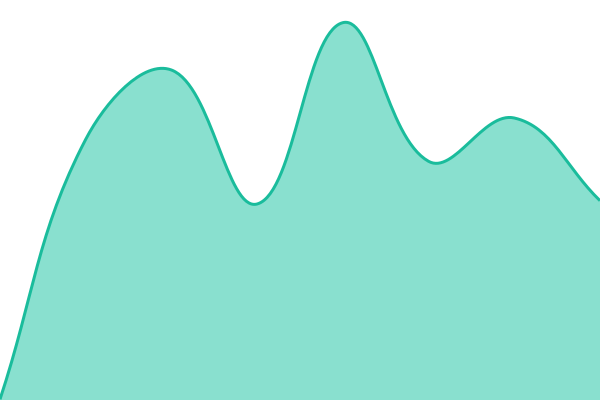

# [📈 Live Status](https://status.examlly.com): <!--live status--> **🟩 All systems operational**

This repository contains the open-source uptime monitor and status page for [examlly-labs](https://status.examlly.com), powered by [Upptime](https://github.com/upptime/upptime).

With [Upptime](https://upptime.js.org), you can get your own unlimited and free uptime monitor and status page, powered entirely by a GitHub repository. We use [Issues](https://github.com/examlly-labs/examlly-status/issues) as incident reports, [Actions](https://github.com/examlly-labs/examlly-status/actions) as uptime monitors, and [Pages](https://status.examlly.com) for the status page.

<!--start: status pages-->
<!-- This summary is generated by Upptime (https://github.com/upptime/upptime) -->
<!-- Do not edit this manually, your changes will be overwritten -->
<!-- prettier-ignore -->
| URL | Status | History | Response Time | Uptime |
| --- | ------ | ------- | ------------- | ------ |
|  [Web app](https://app.examlly.com/login) | 🟩 Up | [web-app.yml](https://github.com/examlly-labs/examlly-status/commits/HEAD/history/web-app.yml) | 

 392ms
     
 | 

<a href="https://status.examlly.com/history/web-app">100.00%</a>
    

|  [API](https://api.examlly.com/status) | 🟩 Up | [api.yml](https://github.com/examlly-labs/examlly-status/commits/HEAD/history/api.yml) | 

 413ms
     
 | 

<a href="https://status.examlly.com/history/api">100.00%</a>
    

|  [Database](https://api.examlly.com/status) | 🟩 Up | [database.yml](https://github.com/examlly-labs/examlly-status/commits/HEAD/history/database.yml) | 

 295ms
     
 | 

<a href="https://status.examlly.com/history/database">100.00%</a>
    

|  [Cache (Redis)](https://api.examlly.com/status) | 🟩 Up | [cache-redis.yml](https://github.com/examlly-labs/examlly-status/commits/HEAD/history/cache-redis.yml) | 

 284ms
     
 | 

<a href="https://status.examlly.com/history/cache-redis">100.00%</a>
    

|  [Paper generation](https://api.examlly.com/status) | 🟩 Up | [paper-generation.yml](https://github.com/examlly-labs/examlly-status/commits/HEAD/history/paper-generation.yml) | 

 274ms
     
 | 

<a href="https://status.examlly.com/history/paper-generation">100.00%</a>
    

|  [PDF](https://api.examlly.com/status) | 🟩 Up | [pdf.yml](https://github.com/examlly-labs/examlly-status/commits/HEAD/history/pdf.yml) | 

 295ms
     
 | 

<a href="https://status.examlly.com/history/pdf">100.00%</a>
    

|  [Chemistry](https://api.examlly.com/status) | 🟩 Up | [chemistry.yml](https://github.com/examlly-labs/examlly-status/commits/HEAD/history/chemistry.yml) | 

 385ms
     
 | 

<a href="https://status.examlly.com/history/chemistry">100.00%</a>
    

<!--end: status pages-->

[**Visit our status website →**](https://status.examlly.com)

## 📄 License

- Powered by: [Upptime](https://github.com/upptime/upptime)
- Code: [MIT](./LICENSE) © [Anand Chowdhary](https://anandchowdhary.com)
- Data in the `./history` directory: [Open Database License](https://opendatacommons.org/licenses/odbl/1-0/)
